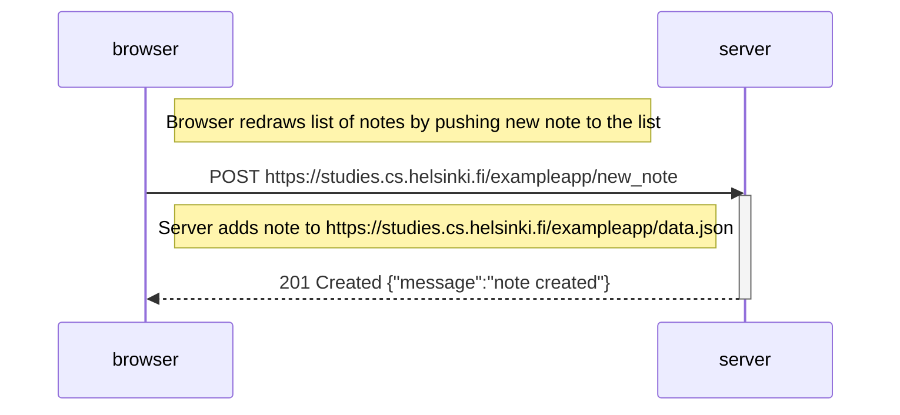

```mermaid
sequenceDiagram
    participant browser
    participant server

    Note right of browser: Browser redraws list of notes by pushing new note to the list

    browser->>server: POST https://studies.cs.helsinki.fi/exampleapp/new_note
    activate server
    Note left of server: Server adds note to https://studies.cs.helsinki.fi/exampleapp/data.json
    server-->>browser: 201 Created {"message":"note created"}
    deactivate server

```
